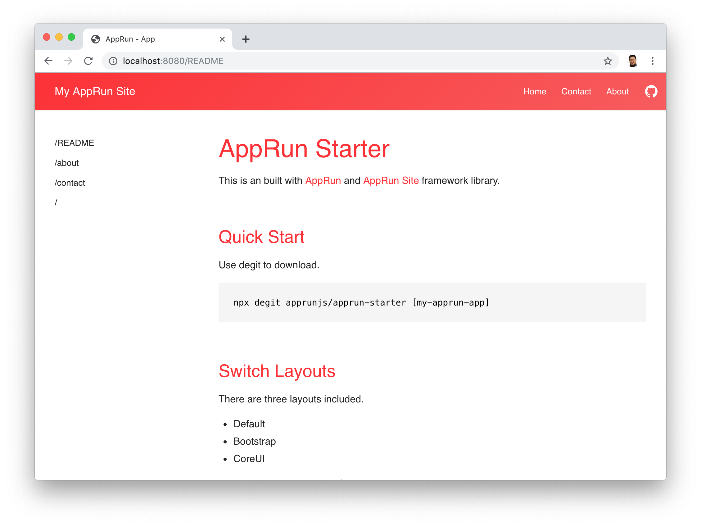
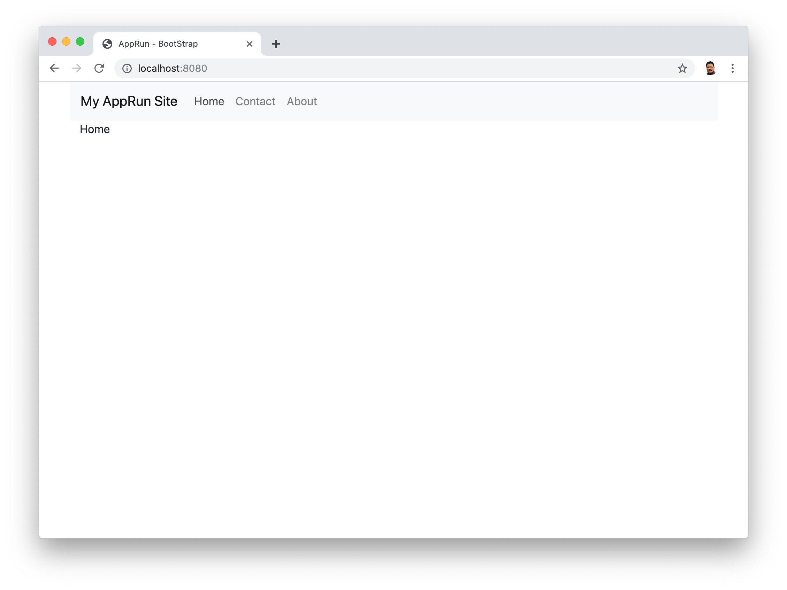
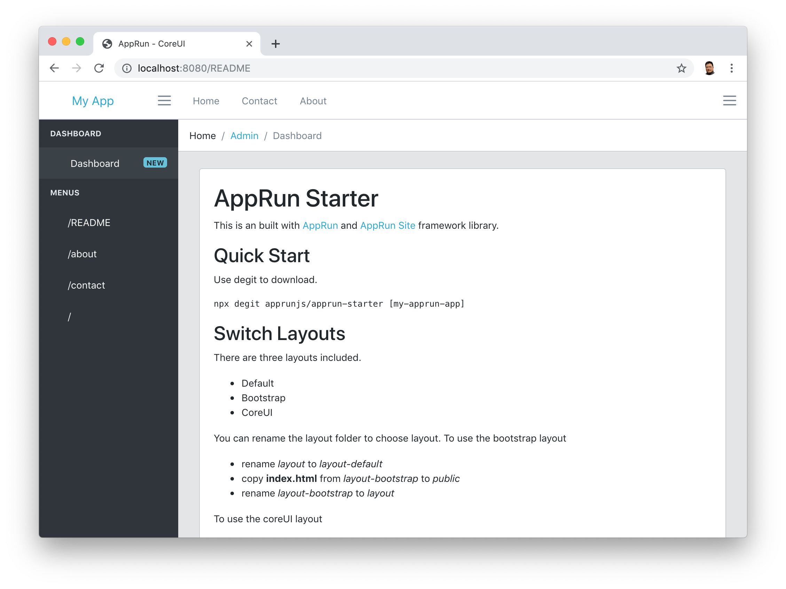
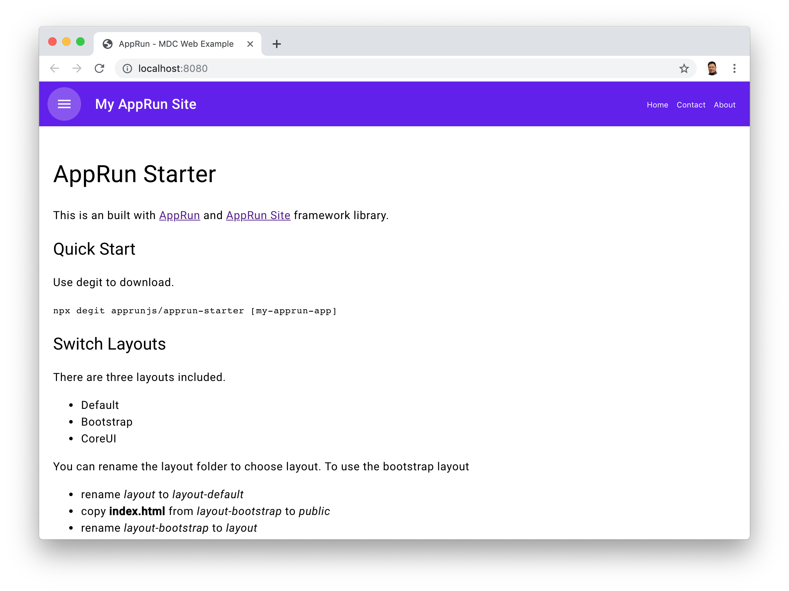

# AppRun Starter

This is an built with [AppRun](https://github.com/yysun/apprun) and [AppRun Site](https://github.com/yysun/apprun-site) framework library.

## Quick Start

Use degit to download.

```sh
npx degit apprunjs/apprun-starter [my-apprun-app]
```

## Switch Layouts

There are four layouts included.

* Default
* Bootstrap
* CoreUI
* Material Design






You can rename the layout folder to choose layout.

### To use the bootstrap layout

* rename _layout_ to _layout-default_
* copy **index.html** from _layout-bootstrap_ to _public_
* rename _layout-bootstrap_ to _layout_

### To use the coreUI layout

* rename _layout_ to _layout-default_
* copy **index.html** from _layout-coreui_ to _public_

* rename _layout-coreui_ to _layout_


### To use the material layout

* rename _layout_ to _layout-default_
* copy **index.html** and **style.css** from _layout-material_ to _public_

* rename _layout-material_ to _layout_


## Run the Application

Use npm commands

* Use _npm install_ to install apprun, typescript and webpack
* Use _npm start_ to start the dev server
* Use _npm run build_ to build for production

Happy Coding.